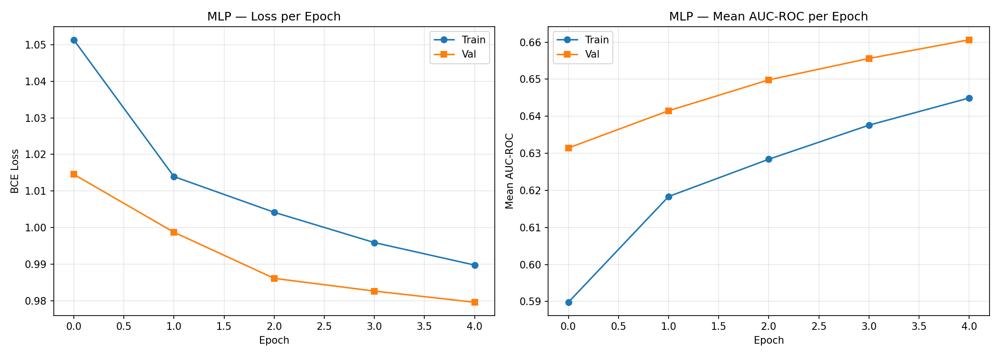
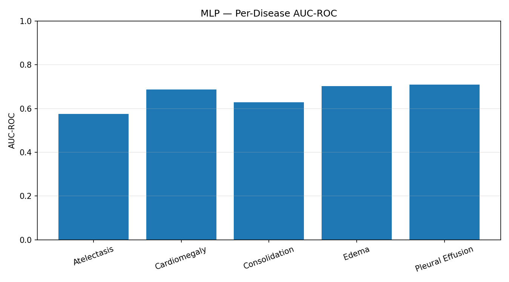
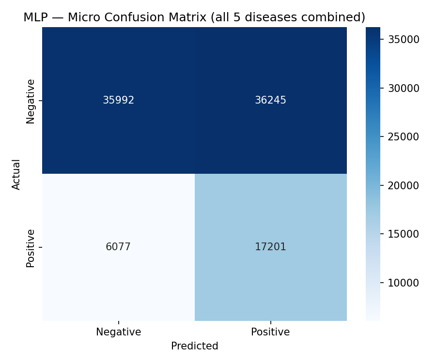
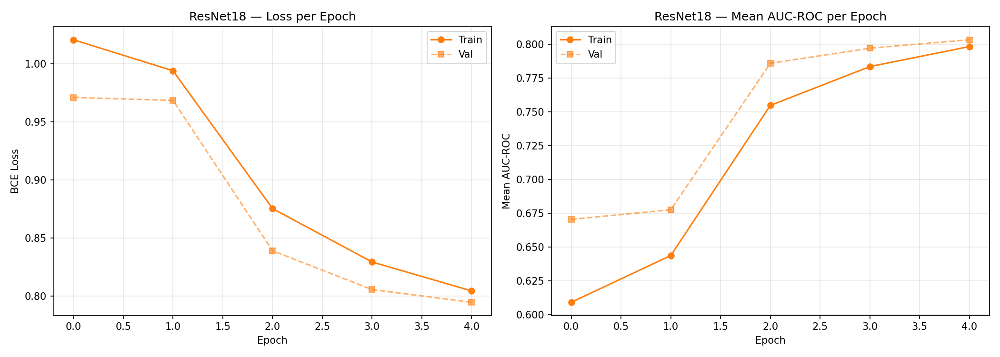
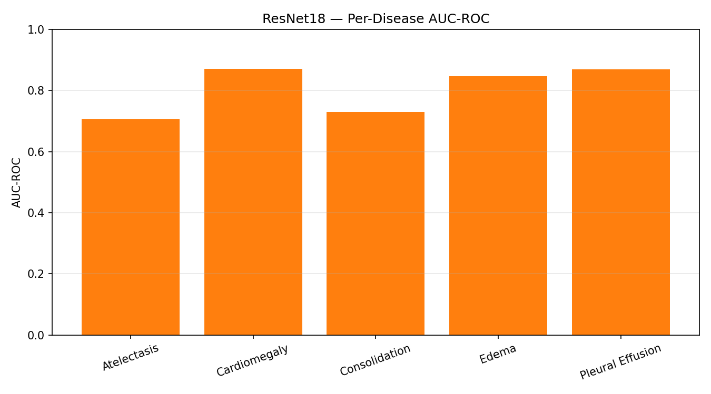
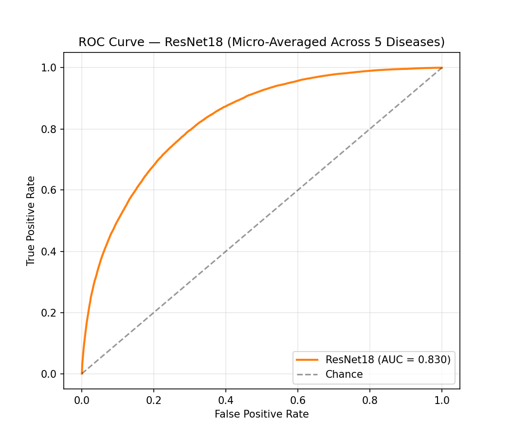
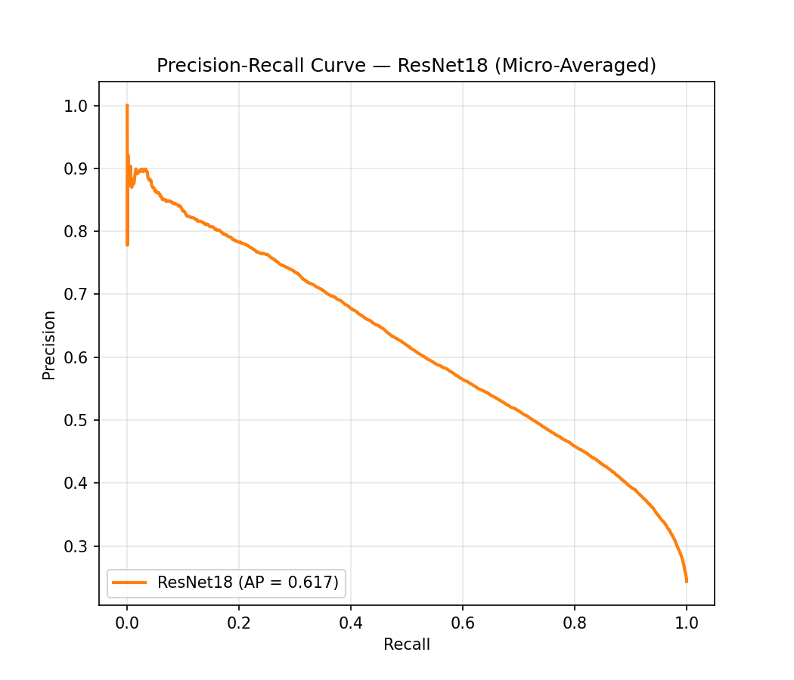
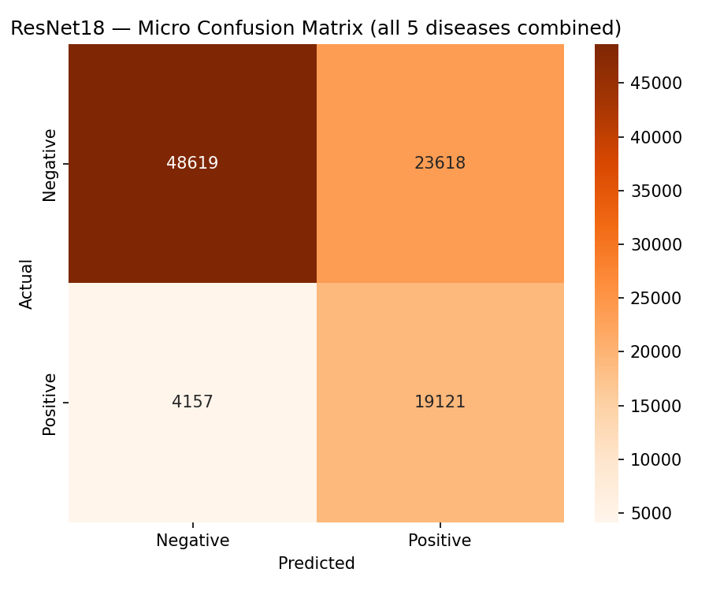

# Chest X-Ray Multi-Label Disease Classification — 4-Model Architecture Comparison

**ICT 4442 — Deep Learning Mini Project**

A controlled comparison of four deep learning architectures — spanning classical, convolutional, recurrent, and attention-based families — for multi-label chest X-ray disease classification on the CheXpert dataset.

> ⚠️ **Status: In Progress.** MLP and ResNet18 are fully trained and evaluated below. CNN-LSTM and ViT are implemented in the notebook but not yet trained — their results will be added here once complete.

## Team

| Member | Model Owned |
|---|---|
| Advait Gujar | MLP (Classical baseline), ResNet18 (CNN) |
| Shashwat Chandore | CNN-LSTM (RNN/LSTM) |
| Ishaan Verma | Vision Transformer (Attention-based) |

## Project Overview

Chest X-rays are one of the most widely used diagnostic tools for detecting thoracic disease, but manual interpretation is time-consuming and subject to inter-radiologist variability. This project trains and compares four architecturally distinct models — a multilayer perceptron (MLP), ResNet18 (CNN), a CNN-LSTM hybrid (RNN/LSTM), and a Vision Transformer (ViT) — under an **identical protocol**: same dataset split, same preprocessing, same loss function, same evaluation metrics. This isolates architecture as the variable being compared, rather than experimental inconsistency.

This is a **multi-label** classification task — each of the 5 target diseases is an independent binary decision, and a patient can have multiple simultaneously. All models use `BCEWithLogitsLoss` and are evaluated primarily on per-disease AUC-ROC.

## Dataset

**CheXpert-v1.0-small** (Stanford ML Group) — frontal-view chest radiographs labeled for 5 thoracic conditions:
- Atelectasis
- Cardiomegaly
- Consolidation
- Edema
- Pleural Effusion

Uncertain labels (`-1`) are resolved via the standard U-Ones/U-Zeros policy. The dataset is split into **train (80%) / validation (10%) / test (10%)**, fixed with a seed and reused identically across all four models (see `outputs/train_split.csv`, `val_split.csv`, `test_split.csv`).

> Note: CheXpert's data use agreement restricts redistribution — this is why the repository is private and dataset files themselves are not included, only derived splits (paths + labels) for reproducibility within the team.

## Models

| Model | Family | Status |
|---|---|---|
| MLP | Classical baseline | ✅ Trained |
| ResNet18 | CNN | ✅ Trained |
| CNN-LSTM | RNN/LSTM | ⏳ Pending |
| Vision Transformer (ViT-B/16) | Attention-based | ⏳ Pending |

## Results So Far

### MLP (Classical Baseline)

**Final Validation AUC: 0.6606** (5 epochs)

| Loss & AUC Curves | Per-Disease AUC |
|---|---|
|  |  |

**Confusion Matrix**



---

### ResNet18 (CNN)

**Final Validation AUC: 0.8034** (5 epochs)

| Loss & AUC Curves | Per-Disease AUC |
|---|---|
|  |  |

| ROC Curve | Precision-Recall Curve |
|---|---|
|  |  |

**Confusion Matrix**



---

### CNN-LSTM (RNN/LSTM) — *Pending*

Training not yet started. Results will be added here once complete.

### Vision Transformer (Attention-based) — *Pending*

Training not yet started. Results will be added here once complete.

---

## Early Observations

- ResNet18 substantially outperforms the MLP baseline (0.80 vs 0.66 validation AUC), consistent with the expectation that convolutional inductive bias meaningfully helps on image data compared to a architecture with no spatial awareness.
- Full 4-model comparison plots (overlaid loss/AUC curves, ROC, and PR curves across all architectures) will be added once CNN-LSTM and ViT training completes.

## Repository Structure

```
├── ChestXray_4Model_Comparison.ipynb   # Full training/evaluation pipeline (all 4 models)
├── outputs/
│   ├── train_split.csv, val_split.csv, test_split.csv
│   ├── mlp_history.json, resnet18_history.json
│   └── *.png                            # All curves, confusion matrices, comparison plots
├── checkpoints/                         # Model weights (not committed — see .gitignore)
└── README.md
```

## How to Reproduce

1. Ensure CheXpert-v1.0-small is downloaded locally
2. Update `DATASET_ROOT` in the notebook's config cell to point at your local dataset path
3. Run all cells top to bottom — the notebook regenerates the exact same splits given the fixed seed

---

*This is an academic project for ICT 4442 (Deep Learning). Not intended for clinical use.*
